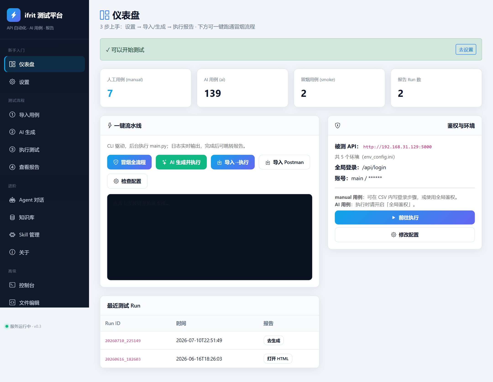
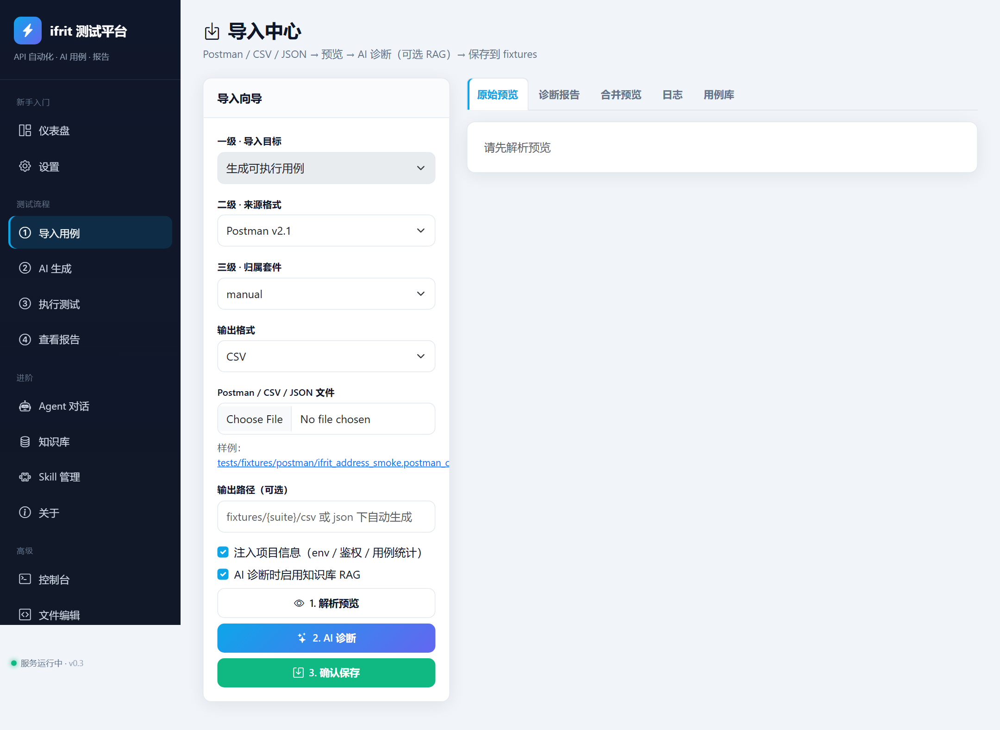
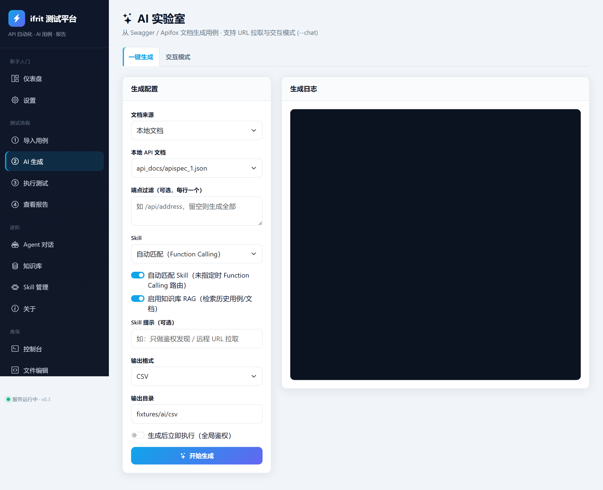
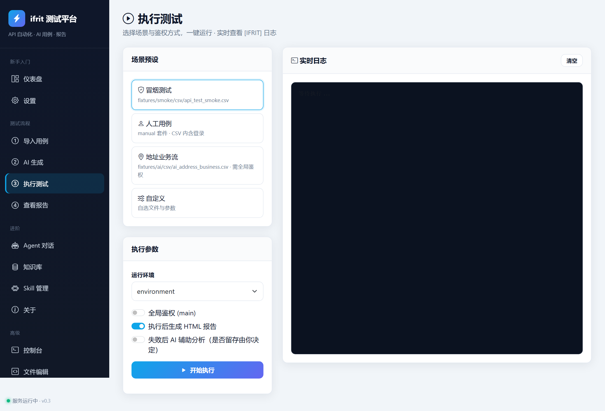
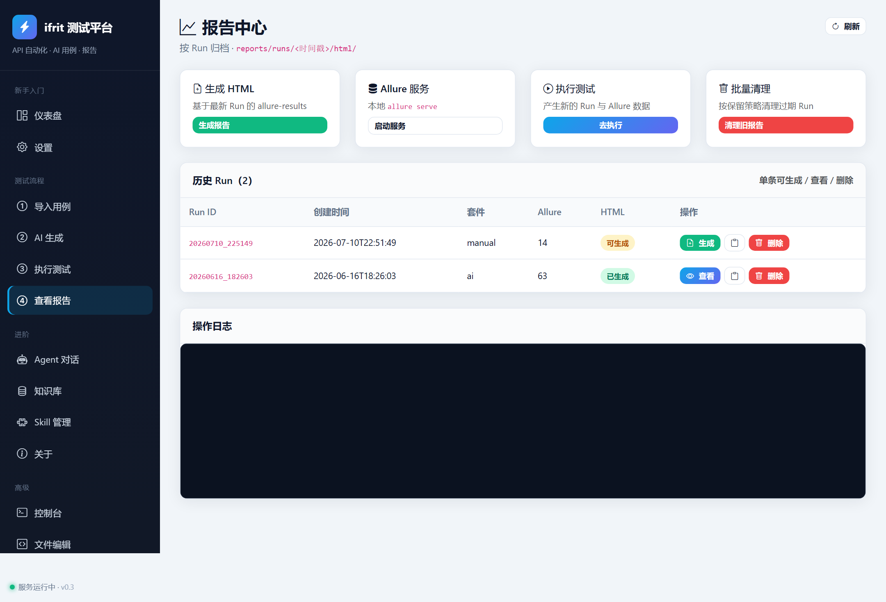
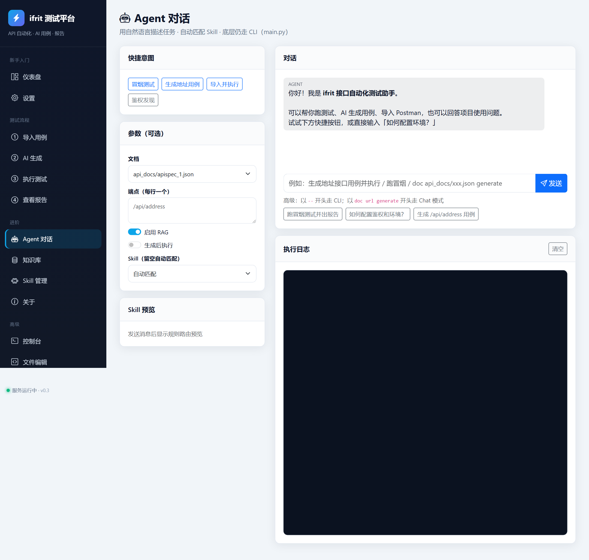
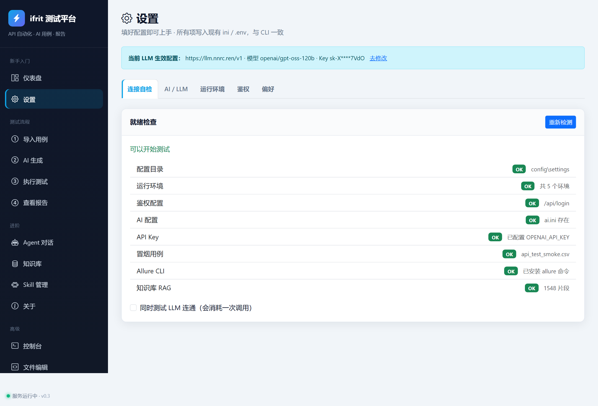

# ifrit API 自动化测试框架

一个功能强大、灵活易用的 API 自动化测试框架，支持数据驱动、AI 智能生成测试用例，并提供可视化 Web UI 操作台。

> 面向测试/业务同学：请优先阅读 [用户详细使用手册.md](用户详细使用手册.md)（含 AI 生成、鉴权、报告、FAQ，无需编程基础）。

## 功能特性

- **数据驱动测试**：支持 Excel、CSV、JSON、YAML 多种格式测试用例
- **AI 智能生成**：从接口文档（Markdown / Swagger JSON / YAML / 在线 URL）自动生成全面测试用例，基于 ReAct + Skill 编排
- **数据关联**：支持接口间数据传递和变量提取，一次提取多个变量分别存储
- **正则表达式**：支持用正则表达式提取响应数据
- **配置分离**：环境配置与测试数据配置分离，支持多环境切换
- **全局鉴权**：全局登录 + token 注入，AI 用例无需内置登录步骤
- **Allure 报告**：美观的测试报告，附带 curl 命令便于问题复现
- **质量验证**：自动验证生成的测试用例质量并提供修复建议
- **数据库支持**：支持从数据库读取测试数据
- **可扩展架构**：模块化设计，易于扩展新格式与新驱动
- **Web UI 操作台**：仪表盘、导入向导、AI 生成、执行、报告、Agent 对话、知识库、Skill 管理等一站式界面

## 界面预览

<div align="center">
  
  <p>仪表盘：用例总览与一键流水线</p>
</div>

<div align="center">
  
  <p>导入中心：Postman / CSV / JSON 预览、诊断与入库</p>
</div>

<div align="center">
  
  <p>AI 生成：文档解析、用例生成与质量校验</p>
</div>

<div align="center">
  
  <p>执行中心：环境预设、全局鉴权与实时日志</p>
</div>

<div align="center">
  
  <p>报告中心：Run 列表与 HTML 报告查看</p>
</div>

<div align="center">
  
  <p>Agent 对话：自然语言驱动 Skill 与 CLI</p>
</div>

<div align="center">
  
  <p>设置中心：AI / 环境 / 鉴权 / 偏好一键配置</p>
</div>

## 快速开始

### 1. 安装依赖

```bash
pip install -r requirements.txt
```

### 2. 启动 Web UI（推荐）

```bash
cd UI
# Windows
run.bat
# Linux / macOS
chmod +x run.sh && ./run.sh
```

浏览器访问 `http://127.0.0.1:5001`。

### 3. 从 API 文档生成测试用例

```bash
# 从 Swagger 文件生成 CSV（输出到 fixtures/ai/csv/）
python main.py --ai-generate --input-doc api_docs/apispec_1.json --swagger-endpoint /api/address --output-format csv

# 从远程 URL 拉取文档（Apifox MD / Swagger）
python main.py --ai-generate --input-url http://192.168.31.129:5000/apispec_1.json --swagger-endpoint /api/address/add

# AI 交互模式
python main.py --chat
python main.py --chat -- doc api_docs/apispec_1.json endpoint /api/address generate
```

### 4. 执行测试用例

```bash
# 运行人工 CSV 用例（默认 manual 套件）
python main.py --type csv

# 运行冒烟用例
python main.py --file fixtures/smoke/csv/api_test_smoke.csv

# 运行 AI 生成用例（建议加 --global-auth）
python main.py --file fixtures/ai/csv/ai_address_business.csv --global-auth --suite ai

# 运行指定环境
python main.py --env environment

# 全流程调试（probe → auth → 生成 → 验证 → prune）
# Windows: debug_workflow.py 参考 scripts/debug_workflow.py
```

### 5. 查看报告

```bash
# 启动报告服务器
python main.py --serve-report

# 清理过期产物（保留策略见 config/settings/app.ini [retention]）
python main.py --clean logs --dry-run
python main.py --clean reports
python main.py --clean all --keep-days 7
```

## 鉴权说明

| 类型 | 用例位置 | 鉴权方式 | 典型命令 |
|------|----------|----------|----------|
| 手工用例 | `fixtures/manual/csv/` | 用例内第 1 步登录，后续用 `{{token}}` | `python main.py --type csv --suite manual` |
| 手工用例 + 全局登录 | 同上 | `config/settings/auth.ini` + `--global-auth` | `python main.py --type csv --suite manual --global-auth` |
| AI 生成用例 | `fixtures/ai/csv/` | 必须 `--global-auth`（用例不含登录行） | `python main.py --file fixtures/ai/csv/xxx.csv --global-auth --suite ai` |

登录配置见 `config/settings/auth.ini`（登录接口 `POST /api/login`）。

## 目录结构

```
ifrit/
├── config/                  # 配置模块
│   ├── loader.py            # 统一加载 .env + settings/*.ini
│   ├── config.py            # 被测 API / 测试数据配置
│   ├── ai_config.py         # LLM / AI 生成配置
│   └── settings/            # 可提交的团队默认配置
├── agent/                   # AI Agent 模块
│   ├── llm/                 # LLM 客户端封装
│   ├── parser/              # 文档解析（Markdown/Swagger）
│   ├── generator/           # 用例生成 / 模板引擎 / 质量验证
│   ├── pipeline/            # AI 生成 / Chat 编排入口
│   ├── actions/             # 原子动作（parse/generate/validate/save...）
│   ├── react/               # ReAct 循环
│   └── skills/              # Skill 注册与路由
├── core/                    # 测试执行核心
│   ├── request_handler.py   # 请求处理
│   ├── assert_handler.py    # 断言处理
│   ├── data_handler.py      # 数据关联与正则提取
│   ├── test_executor.py     # 测试执行器
│   ├── test_runner.py       # 测试运行器
│   ├── cli_manager.py       # CLI 参数管理
│   ├── report_manager.py    # 报告管理
│   ├── auth_manager.py      # 全局鉴权
│   ├── case_discovery.py    # 用例发现
│   └── case_catalog.py      # 用例目录
├── UI/                      # Web UI 操作台（Flask）
│   ├── app.py               # 入口（端口 5001）
│   ├── templates/           # 页面模板
│   ├── static/              # CSS / JS
│   └── services/            # 业务服务层
├── utils/                   # 工具类（logger / test_case_reader）
├── drivers/                 # Pytest 测试驱动（Excel/CSV/JSON）
├── fixtures/                # 测试用例数据
│   ├── manual/              # 人工编写用例（csv/json/excel）
│   ├── ai/                  # AI 生成用例
│   └── smoke/               # 冒烟用例
├── scripts/                 # 辅助脚本
├── docs/                    # 文档与截图
├── __docs/                  # 详细使用/二次开发手册
├── tests/                   # 单元测试
├── __internal_tests/        # 内部单元测试（历史）
├── main.py                  # 主程序入口
├── pytest.ini
└── requirements.txt
```

## AI 功能详细说明

- **文档格式**：Markdown、Swagger JSON/YAML、在线文档 URL
- **生成类型**：正向、反向、边界、结构、路径、权限测试用例
- **输出格式**：Excel、CSV、JSON
- **质量保证**：自动质量验证与修复建议
- **批量处理**：支持多文档批量生成
- **多值提取**：一次提取多个变量并分别存储

详细使用方法见 [用户详细使用手册.md](用户详细使用手册.md) 与 [__docs/AI_GUIDE.md](__docs/AI_GUIDE.md)。

## 运行单元测试

```bash
# 所有内部单元测试
python -m unittest discover __internal_tests/

# 指定模块
python __internal_tests/test_engines.py
python __internal_tests/test_parsers.py
python __internal_tests/test_utils.py
python __internal_tests/test_business_logic.py

# Pytest 驱动测试
pytest drivers/
```

## 二次开发

1. **新增数据格式**：在 `core/` 增加解析器，在 `drivers/` 增加测试驱动，在 `core/cli_manager.py` 注册格式选项
2. **扩展断言**：修改 `core/assert_handler.py` 增加断言类型

详细开发方法见 [__docs/ifrit-二次开发详细手册.md](__docs/ifrit-二次开发详细手册.md) 与 [__docs/ifrit-yaml数据驱动手册.md](__docs/ifrit-yaml数据驱动手册.md)、[__docs/ifrit-数据库数据驱动.md](__docs/ifrit-数据库数据驱动.md)。

## 配置说明

| 类型 | 位置 | 示例 |
|------|------|------|
| 敏感 / 个人 | `.env`（已 gitignore） | `OPENAI_API_KEY`、`OPENAI_BASE_URL`、`DINGTALK_ACCESS_TOKEN` |
| 团队稳定 | `config/settings/*.ini` | 测试环境 URL、LLM endpoint、列映射 |

首次使用：`cp .env.example .env` 并填写本地密钥。

## 环境要求

- Python 3.10+
- 依赖：`pip install -r requirements.txt`
- Allure 报告功能需安装 Allure 命令行工具
- AI 生成功能需有效的 LLM API Key 和网络连接

## CI

GitHub Actions 见 `.github/workflows/ci.yml`：push/PR 自动跑单元测试与用例发现校验；smoke 需配置仓库 Secret `IFRIT_BASE_URL`，未配置时自动跳过。

## 开发规范

本项目遵循中文注释、语义化命名、参数校验等开发标准，规范详见 `scripts/` 与 `__docs/`。

## 其他资源

- [用户详细使用手册.md](用户详细使用手册.md) — 面向用户端，AI 流程 + 鉴权 + FAQ（推荐）
- [__docs/ifrit使用手册.md](__docs/ifrit使用手册.md) — 技术向使用说明（含 Allure 部署）
- [__docs/AI_GUIDE.md](__docs/AI_GUIDE.md) — AI 功能与生成策略
- [__docs/ifrit命令手册.md](__docs/ifrit命令手册.md) — 完整命令参数说明
- [__docs/ifrit-二次开发详细手册.md](__docs/ifrit-二次开发详细手册.md) — 二次开发指导
- [__docs/ifrit-yaml数据驱动手册.md](__docs/ifrit-yaml数据驱动手册.md) — YAML 数据驱动使用说明
- [__docs/ifrit-数据库数据驱动.md](__docs/ifrit-数据库数据驱动.md) — 数据库数据驱动使用说明

## 贡献

欢迎提交 Issue 和 Pull Request 来改进框架。

## 许可证

[MIT License](LICENSE)
